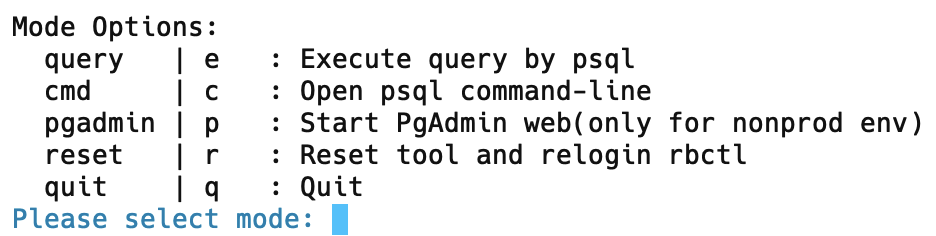

# damo-tool

## Introduce
An useful DB tool🧰 to debug🐞.

## How to use
1. Clone this repo.
2. Change file mode to executable for file `script/damo_tool`.
3. Modify config file `config.json` or download a pre-prepared config file to the same path of the executable file.
4. Enjoy it.